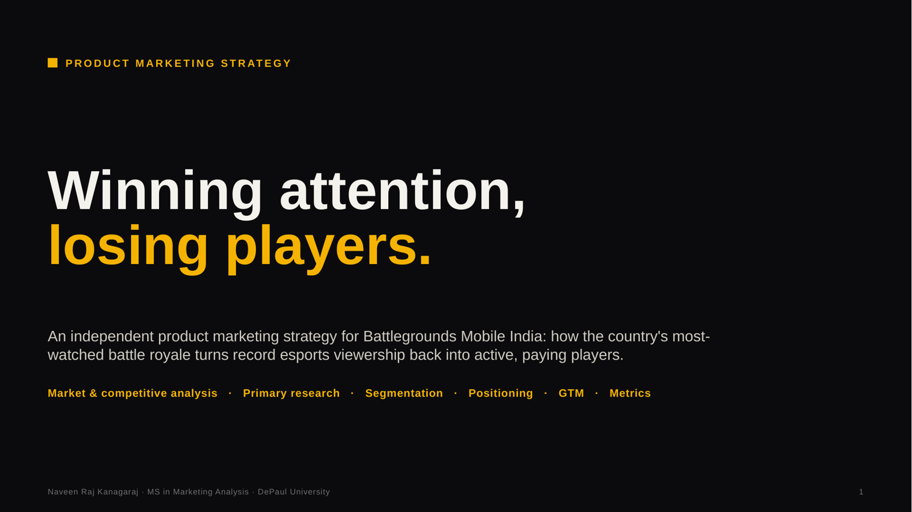
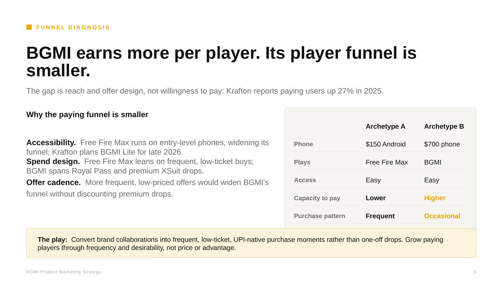
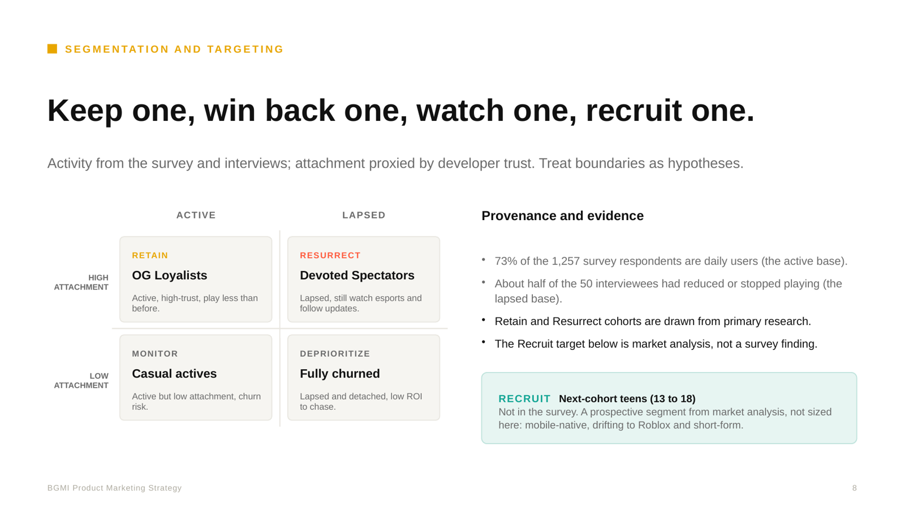
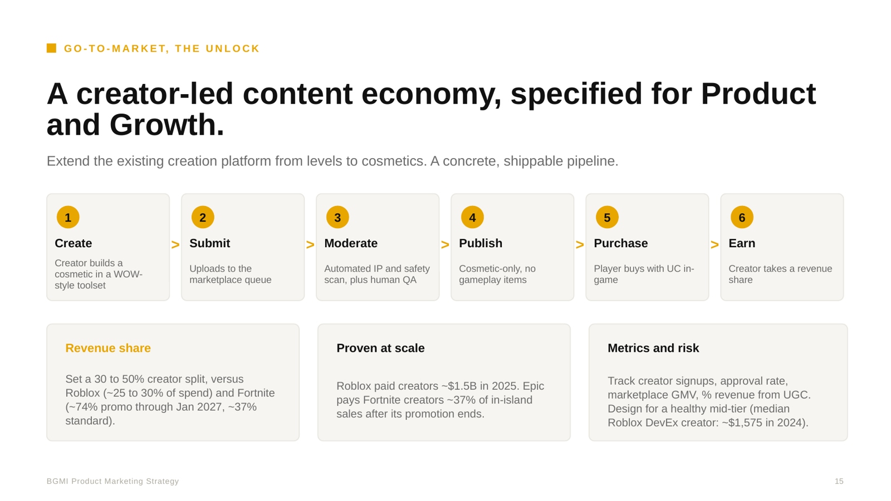

# Winning Attention, Losing Players: BGMI Product Marketing Strategy

An independent product marketing strategy for Battlegrounds Mobile India (BGMI): how India's most-watched battle royale can turn record esports viewership back into active, paying players. Case study by Naveen Raj Kanagaraj, MS in Marketing Analysis, DePaul University.

This is an independent case study. It is not affiliated with or endorsed by Krafton. Primary research is my own; external figures are attributed below, and third-party estimates are labeled as estimates.

**[Read the full deck (PDF)](bgmi-pmm-strategy.pdf)**

## The diagnosis

BGMI does not have a demand problem or a willingness-to-pay problem.

- **Attention is at a record.** Krafton reported BGMI esports viewership of 930M+ in 2025 (up from 308.6M in 2024) and 86.78M unique viewers. BMPS 2026 set BGMI's peak-viewer record at ~729K.
- **Payers are growing.** Krafton reported BGMI paying users up 27% in 2025 and 17% year over year in Q1 2026.
- **Players are shrinking.** Third-party estimates show BGMI's monthly active users down ~14% from Q1 2024 to Q1 2026, while Roblox grew.

On this deck's revenue and MAU estimates, BGMI earns about 1.45x more revenue per monthly active user than Free Fire Max. Free Fire Max out-earns BGMI because it reaches far more players, not because each player spends more. The strategic problem is **scale and retention**.

## The strategy

1. **Stabilize and communicate.** Survey respondents most often selected server stability, bug fixes, and performance as priorities, far ahead of new content. Make reliability fixes visible before spending on demand.
2. **Reactivate.** Use the esports audience as a reactivation channel for lapsed players (a hypothesis to validate).
3. **Recruit and monetize.** Widen the paying funnel with frequent, low-ticket purchase moments, and extend BGMI's creation mode into a creator cosmetics marketplace with a 30-50% creator revenue share.

## Selected slides

| | |
|---|---|
|  |  |
|  |  |

## What is inside

- **Market position:** esports reach, downloads, and viewership records
- **Competitive benchmarks:** estimated revenue and MAU versus Free Fire Max and Roblox, with revenue per MAU
- **Funnel diagnosis:** why BGMI's paying funnel is smaller despite higher per-player revenue
- **Voice of customer:** a 1,257-response survey and 50 interviews
- **Segmentation and personas:** retain, resurrect, and recruit cohorts, with hypotheses labeled
- **Competitive landscape and battlecard:** battle royale rivals and creation platforms
- **Positioning and messaging framework**
- **Go-to-market:** a reliability-gated, three-phase plan
- **Creator economy specification:** pipeline, revenue share benchmarks, and metrics
- **North Star metric:** weekly engaged payers, with its input tree
- **Risks and validation plan**

## Primary research

I designed and ran the survey (n = 1,257) and conducted 50 semi-structured interviews with active and lapsed players. The data cleaning, PostgreSQL model, SQL analysis, and Tableau dashboards are in the companion repo: [product-analytics-user-experience](https://github.com/naveen-raj-kanagaraj/product-analytics-user-experience).

Notes on method:
- The priority question was multi-select, so counts exceed the number of respondents.
- Experience scores compare respondent groups within one survey, not the same players over time.
- About 73% of survey respondents are daily players; lapsed-player views come mainly from the interviews.
- Attachment is proxied by developer trust, so cohort boundaries are hypotheses.

## Sources

- Krafton FY2025 results, BGMI paying users +27%: [Outlook Respawn](https://respawn.outlookindia.com/gaming/gaming-news/bgmi-paying-users-jump-27-yoy-as-krafton-hits-record-revenue)
- Krafton Q1 2026, BGMI paying users +17%: [Business Standard](https://www.business-standard.com/industry/news/bgmi-paying-users-climb-17-amid-rise-in-india-s-in-game-spending-trends-126051301137_1.html)
- 260M+ cumulative downloads and BGMI Lite plans (Krafton Q1 2026): [Inven Global](https://www.invenglobal.com/articles/24837/krafton-to-launch-lightweight-bgmi-lite-in-india-by-late-2026)
- 2025 esports viewership and unique viewers (Krafton): [Prism News](https://www.prismnews.com/hobbies/mobile-gaming/indias-mobile-gaming-market-grows-but-bgmi-and-free-fire)
- BMPS 2026 peak viewers: [Esports Charts](https://escharts.com/news/bgmi-new-peak-viewership-milestone)
- BGIS 2026 peak viewers on Krafton's channel: [Sportsadda](https://www.sportsadda.asia/esports/news-esports/bgis-2026-grand-finals-smash-indian-mobile-esports-viewership-record-with-600000-concurrent-viewers/)
- Roblox 2025 creator payouts: [Statista](https://statista.com/statistics/1376672/roblox-developer-payout)
- Roblox median DevEx creator earnings: [Roblox Economic Impact Report](https://about.roblox.com/newsroom/2025/09/roblox-annual-economic-impact-report)
- Fortnite in-island transaction revenue share: [GameSpot](https://www.gamespot.com/articles/fortnite-creators-will-soon-be-able-to-sell-in-game-items-pay-for-visibility/1100-6534859/)
- Valorant Mobile availability (China-only): [Turbosmurfs](https://turbosmurfs.gg/article/valorant-mobile-release-date)
- Regulation: Promotion and Regulation of Online Gaming Act, 2025; Digital Personal Data Protection Act, 2023
- Revenue and MAU benchmarks: third-party estimates compiled from Sensor Tower data. Figures vary by source and should be read as directional.

## Files

- `bgmi-pmm-strategy.pdf`: the full deck
- `thumb-*.png`: slide previews used in this README
