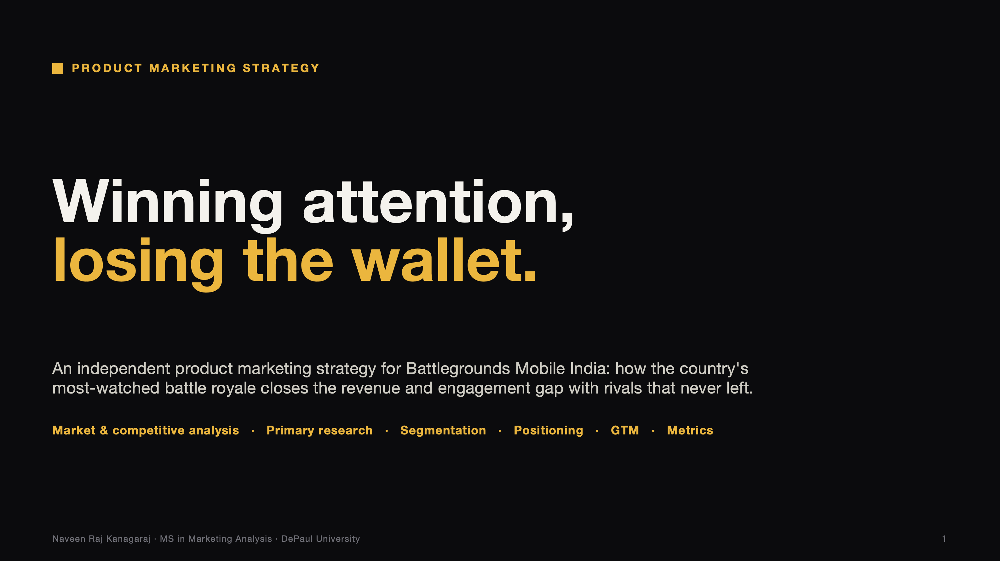
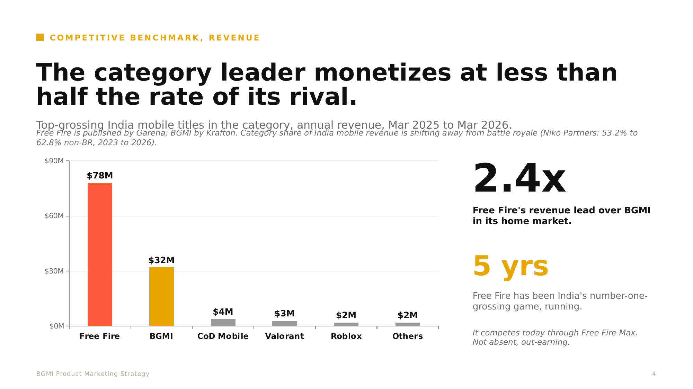
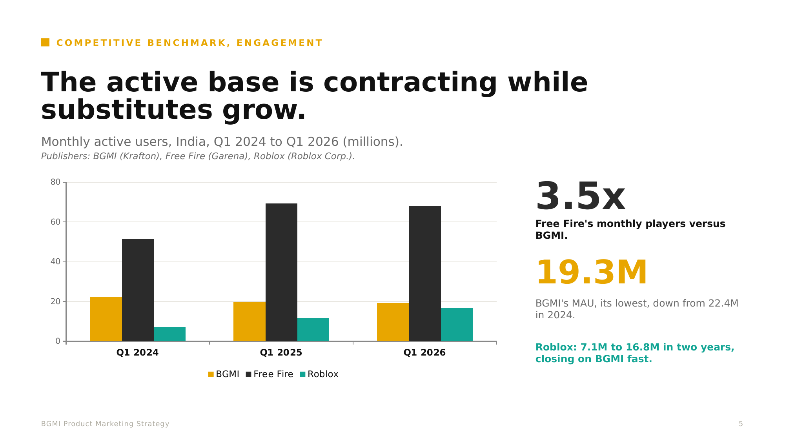
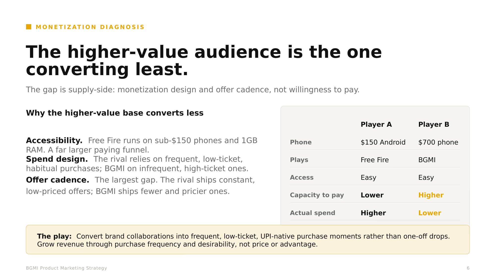
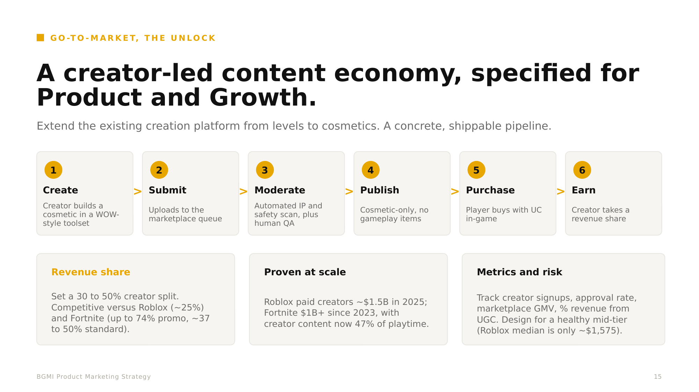
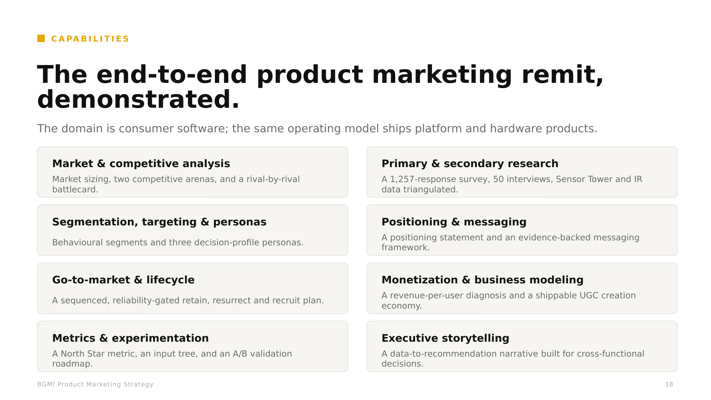

# BGMI Product Marketing Strategy

Battlegrounds Mobile India (BGMI) is one of India's most-downloaded and most-watched games, yet it monetizes at less than half the rate of its closest competitor and its active base is shrinking. This is an independent product marketing strategy to close that gap.

**Author:** Naveen Raj Kanagaraj - MS in Marketing Analytics, DePaul University
**Companion analytics project:** [product-analytics-user-experience](https://github.com/naveen-raj-kanagaraj/product-analytics-user-experience) - the 1,257-response survey and 50 interviews I designed and led, which this strategy is built on.

[**Read the full deck (PDF)**](bgmi-pmm-strategy.pdf)

## The problem

The category leader by attention is a laggard in revenue. BGMI has the audience, it leads on reach and viewership, but converts far less of it to revenue than its rival and is losing monthly actives. This is a monetization and retention problem, not a demand problem, and it is addressable.

## What the data shows

- **Monetizes below its rival.** Free Fire grosses roughly **$78M** in India versus BGMI's **$32M** (about 2.4x), and has led the category on revenue for five straight years.
- **Contracting base.** BGMI's monthly active users have fallen to roughly **19.3M**, its lowest, while the rival sits near **68M** and substitute platforms are growing.
- **Supply-side gap.** BGMI's higher-value audience converts least. The gap is monetization design and offer cadence, not willingness to pay.
- **Reliability drives churn.** Across 1,257 survey responses, users rank stability, bug fixes and performance well above new content.
- **The market is moving.** Non-battle-royale titles rose from 53.2% to 62.8% of India mobile game revenue (2023 to 2026), evidence the wallet is shifting toward creator-led and social content (Niko Partners).

## The recommendation

Stabilize product trust first, funded by reallocating content spend. Then reactivate the lapsed base (a warm audience already reached through viewership) and grow from there. Close the revenue gap with a creator-led content economy and frequent, low-ticket, UPI-native offers, raising revenue through purchase frequency and desirability rather than price or advantage. Measure everything on one North Star: unique payers with at least one session and one purchase in a rolling 7-day window (WAU x payer rate x purchase frequency).

## Approach

Self-conducted primary research (a 1,257-response survey and 50 interviews) triangulated with market data from Sensor Tower, Krafton's investor disclosures, and Niko Partners. The deck runs situation, diagnosis, then recommendation, with segmentation, personas, positioning, a staged go-to-market, a North Star metric tree, and a risks-and-validation section.

## Skills demonstrated

Market and competitive analysis, primary and secondary research, segmentation, targeting and personas, positioning and messaging, go-to-market and lifecycle, monetization and business modeling, metrics and experimentation, and executive storytelling.

The domain is consumer software; the same operating model ships platform and hardware products.

## Sources

- **Primary research** — survey (n = 1,257) and 50 interviews I designed and led: [github.com/naveen-raj-kanagaraj/product-analytics-user-experience](https://github.com/naveen-raj-kanagaraj/product-analytics-user-experience)
- **India revenue** — Sensor Tower, India (Mar 2025 to Mar 2026), author's own data pull.
- **Engagement / MAU** — letsgrowesports (Sensor Tower estimates): [x.com/letsgrowesports](https://x.com/letsgrowesports/status/2079202738487931100)
- **Category revenue shift and payments** — Niko Partners, India Player Behavior & Market Insights, 2026.
- **Viewership** — Esports Charts: [BGMI hub](https://escharts.com/games/bgmi) and [BMPS 2026 record (~730K peak)](https://escharts.com/news/bgmi-new-peak-viewership-milestone).
- **Company strategy** — Krafton Investor Relations: [krafton.com/en/ir/investor-events/announce](https://www.krafton.com/en/ir/investor-events/announce/)
- **UGC precedents** — Roblox and Epic Games creator-payout disclosures, 2025 to 2026.

**Methodology notes:** MAU figures are third-party estimates. Niko revenue excludes real-money gaming and exports. Player A and Player B are illustrative device-and-spend archetypes, not survey respondents.

---

*Independent analysis for portfolio purposes. Not affiliated with or endorsed by Krafton or BGMI.*
